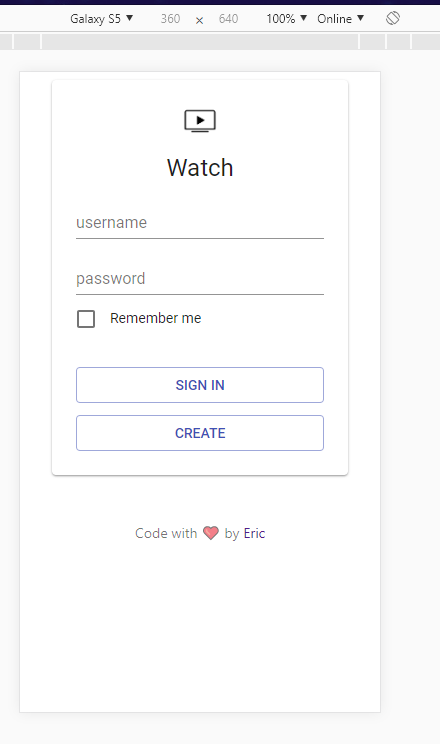
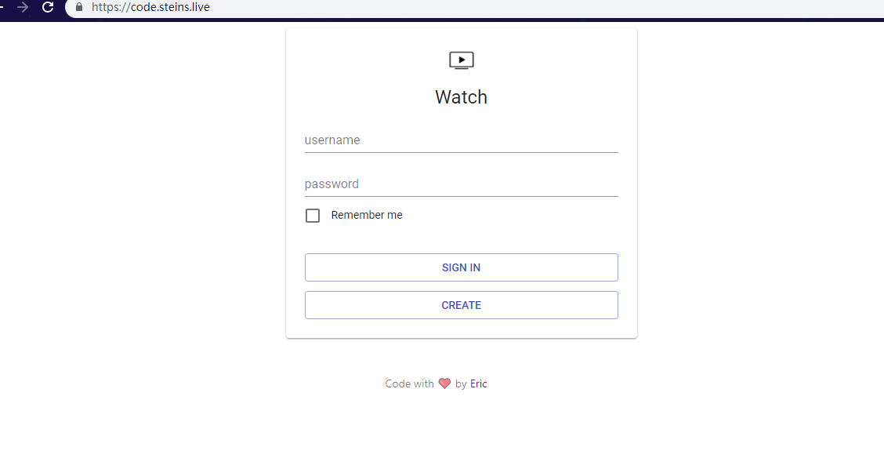
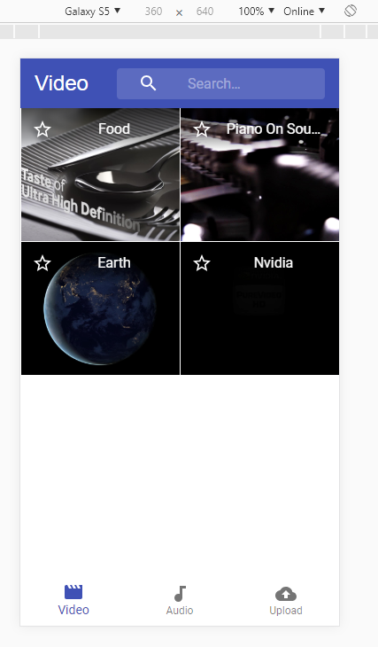
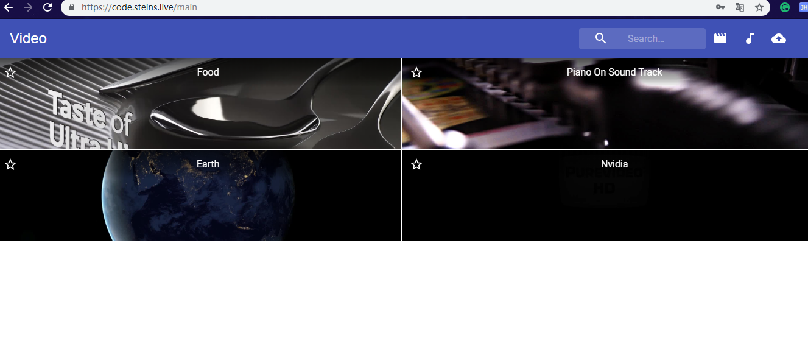
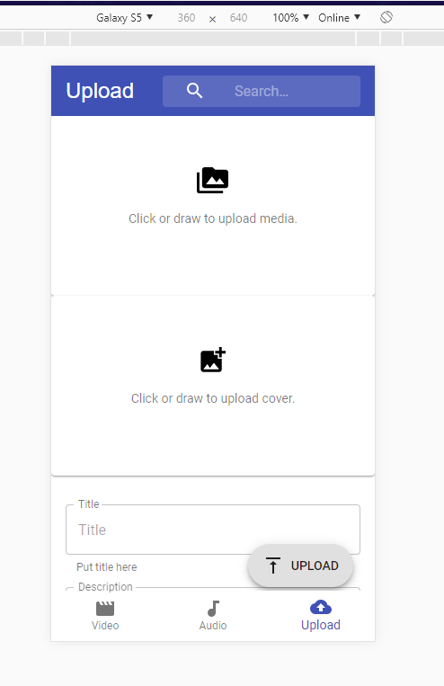
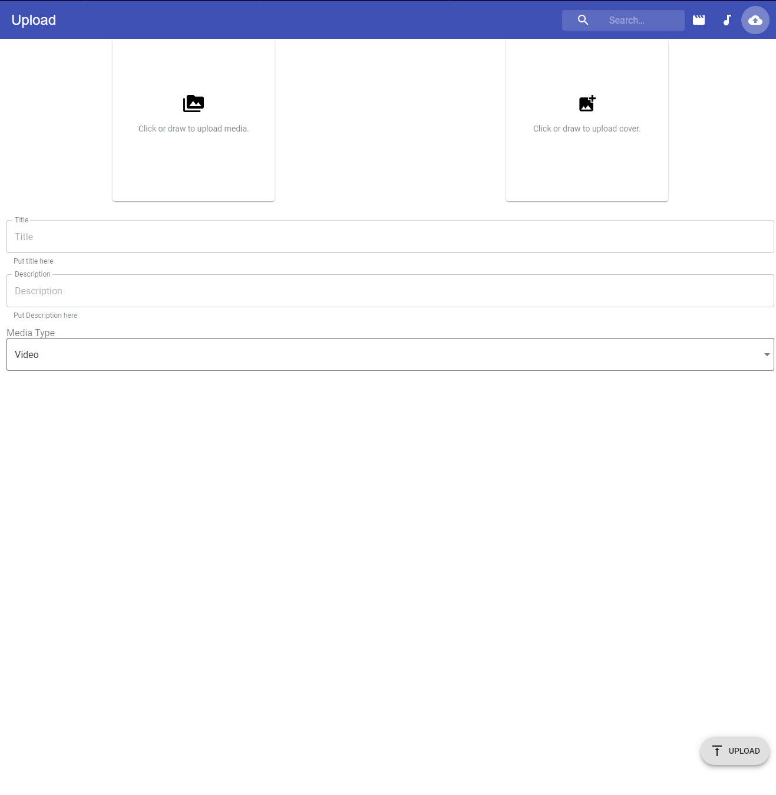
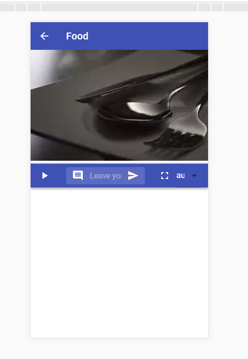
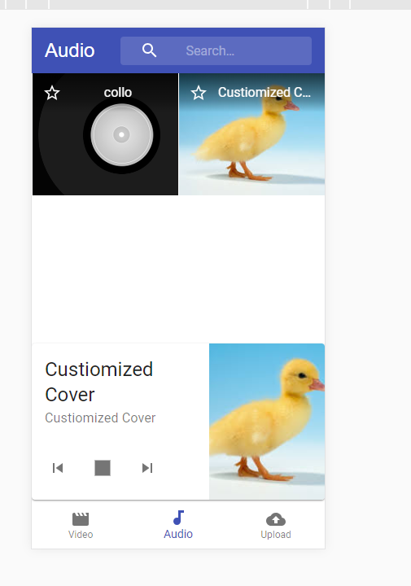

# Fancy Video

## What it is   

### Fancy video is a react based PAW that allow users to watch/upload media content(video and audio) and stream the media content based on the dash protocol. That means it allow users to switch the video quality at any time without any stall.

[Click](https://code.steins.live) to view the online demo.

## Tech Spec

- ``Dash.js`` to support the dash decoding in the front end.
- ``React`` and ``Material-UI`` to build up the front end.
- ``lowdb`` works as a non-relation database for quick prototype.
- ``MP4Box`` and ``ffmpeg`` to encode incoming media file and transform the file into dash file.
- ``crypto.js`` to ensure that the password, username and seesion will be encoded during transimission time.
- Responsive UI

## Screenshots
<table>
    <tr>
        <td ><center>Login Mobile view </center></td>
        <td ><center>Login Desktop view</center></td>
    </tr>
    <tr>
        <td ><center>Main Mobile view </center></td>
        <td ><center>Main Desktop view</center></td>
    </tr>
    <tr>
        <td ><center>Upload Mobile view </center></td>
        <td ><center>Upload Desktop view</center></td>
    </tr>
    <tr>
        <td ><center>Video Mobile view </center></td>
        <td ><center>Video Desktop view</center></td>
    </tr>
    <tr>
        <td>
            <center>
                 Audio play mobile view
            </center>
        </td>
    </tr>
</table>


## How to run locally
Besure to include the ``MP4Box`` and ``ffmpeg`` first.
Also ``yarn`` and ``npm`` are necessary.
```bash
git clone https://github.com/WenheLI/Fancy-Video.git
cd sever
npm && npm start
cd ../uwatch
yarn && yarn start
```

## TODO list

- Danmuku support(live comments)
- Multi media type support
- Live streaming 
- YOLO3 embeded to support danmuku mask.